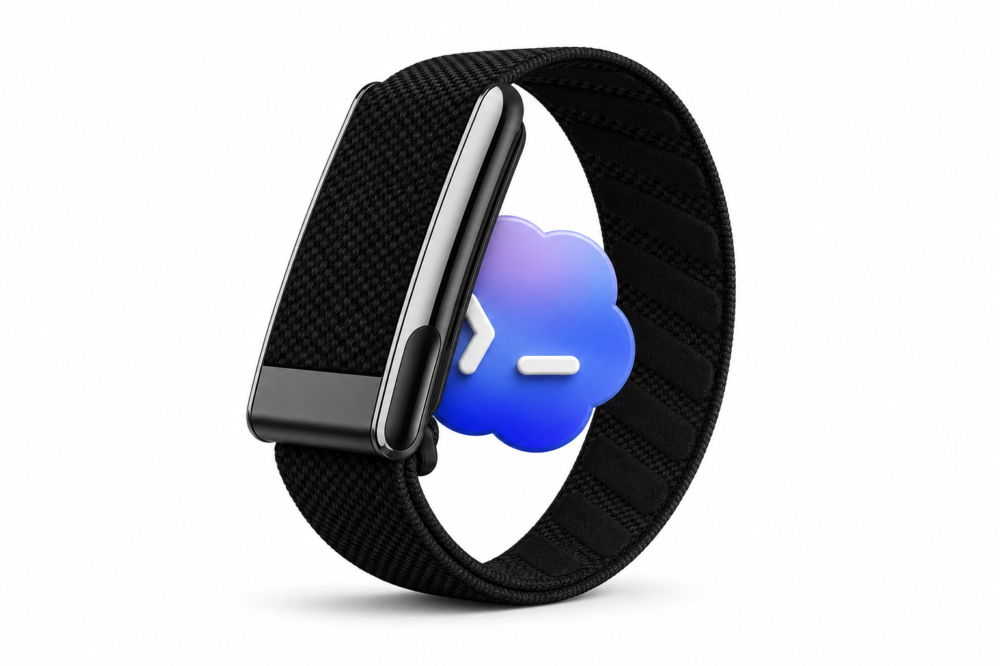
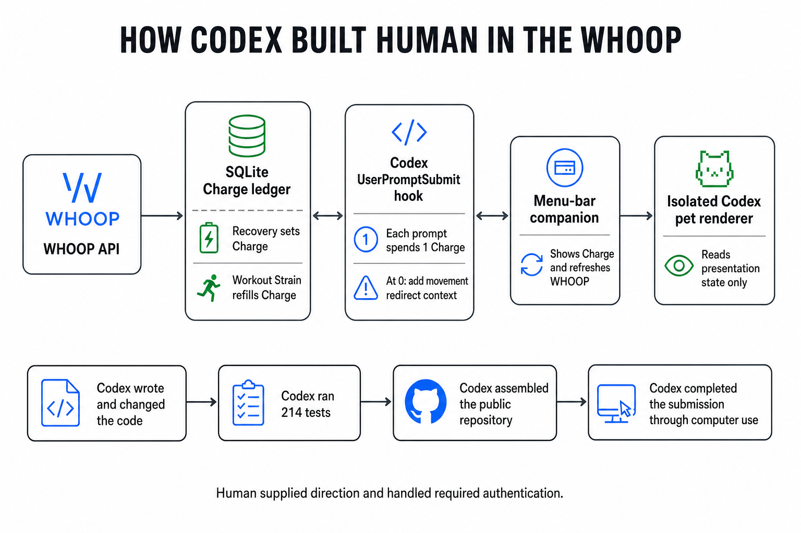

# Human in the Whoop

Human in the Whoop is a local macOS companion for WHOOP and Codex.



[Watch the 24-second demo](docs/media/human-in-the-whoop-demo.mp4).

## What it does

- The latest eligible WHOOP Recovery score sets Charge. Recovery 72 becomes 72/100.
- Each submitted Codex prompt spends 1 Charge.
- A newly scored WHOOP workout refills Charge from Workout Strain.
- At 0, the Codex hook adds context that redirects the agent toward an appropriate activity. The hook still returns `continue: true`.
- The menu-bar companion shows Charge, refreshes WHOOP data, and contains the on/off control.
- Turning the feature off stops prompt accounting and WHOOP polling. Codex then behaves normally.

Workout refills use:

```text
max(1, round(50 × (Workout Strain / 21)²))
```

The result is capped at 100. Each workout UUID is applied once.

## Interface


The number is the current Charge balance. WHOOP refresh, demo controls, status, and other settings are under **Advanced**.


The WHOOP sensor is an optional presentation layer. It reads presentation state and does not write Charge, WHOOP data, or prompt state.

## System



- `WhoopAPIClient` reads WHOOP v2 Recovery, cycle, sleep, and workout data.
- `WhoopSyncService` validates records and applies Recovery resets and workout refills.
- `SQLiteStateStore` holds the local Charge ledger and workout deduplication state.
- `hitw-hook` runs on Codex `UserPromptSubmit`.
- The menu-bar app reads the same ledger and refreshes WHOOP while enabled.
- The pet proof reads a local presentation endpoint from an isolated Codex copy.

## Requirements

- macOS 15 or later
- Swift 6.1 or later
- Codex desktop
- A WHOOP developer application with these scopes:
  - `offline`
  - `read:recovery`
  - `read:cycles`
  - `read:sleep`
  - `read:workout`

## Judge verification

No WHOOP account or credentials are needed for the non-live verification path:

```bash
./scripts/verify-demo.sh
```

This runs all 214 tests, builds the release products, packages and verifies the signed menu-bar app without installing or launching it, and validates the sanitized local status output. The tests use isolated fixtures and do not modify the judge's Codex app.

## Setup

1. Create and authorize a WHOOP developer application.
2. Complete the WHOOP OAuth exchange.
3. Store the client secret, access token, and refresh token as generic passwords in macOS Keychain.

   | Value | Keychain service |
   |---|---|
   | Client secret | `human-in-the-whoop.whoop-client-secret` |
   | Access token | `human-in-the-whoop.whoop-access-token` |
   | Refresh token | `human-in-the-whoop.whoop-refresh-token` |

   Use the WHOOP OAuth client ID as the Keychain account for all three items. Missing, duplicate, or mismatched items leave the feature unavailable and Codex unchanged.

4. Build, test, package, and install:

   ```bash
   swift test
   ./scripts/package-app.sh
   ./scripts/test-package-app.sh
   ./scripts/install-local.sh
   ```

5. Restart Codex or start a new Codex process.
6. Review and trust the installed `UserPromptSubmit` hook through Codex's hook review UI.
7. Open **Human in the Whoop** from the macOS menu bar and turn it on.

Installation starts in Soft Off mode. It does not call WHOOP until the feature is enabled.

## Use

- **Refresh WHOOP Now** performs one read-only WHOOP refresh.
- Enabled polling runs at launch, after wake, and every 15 minutes.
- Local Charge is reread every second so prompts from any local Codex window appear in the menu.
- **Reset Demo** resets Charge locally. It does not write to WHOOP.
- The menu toggle is Soft Off and preserves local state.

Installed CLI:

```text
~/Library/Application Support/Human in the Whoop/bin/hitwctl
```

Commands:

```text
status [--json]
enable
disable
refresh [--json]
reset-demo --yes
delete-local-data --yes
```

To remove the hook and stop the companion:

```bash
./scripts/hard-disable.sh
```

## Data handling

- WHOOP access is read-only.
- OAuth values stay in macOS Keychain.
- Local state stays in `~/Library/Application Support/Human in the Whoop/`.
- Prompt text is not stored.
- The hook fails open.
- Off or unavailable state falls back to regular Codex.
- No WHOOP token, health record, device identifier, local database, or copied Codex binary is stored in this repository.

## How I used Codex + GPT-5.6

Codex did everything (forms, WHOOP integration, pet, computer use, code, tests, and this submission). I just did the auth.

GPT-5.6 was the main model behind the build. It worked through the product decisions with me, inspected the actual Codex app mechanics, implemented the Swift companion and prompt hook, debugged the native pet renderer from live logs, generated the visual assets, ran the 214-test suite, and verified the real WHOOP flow end to end.

The pet proof modifies an isolated copy of the Codex renderer. It does not modify my everyday Codex app.

The related note on visual reasoning is [Thinking in Images](https://x.com/RandyHaddad6/status/2069842784106971341?s=20).
